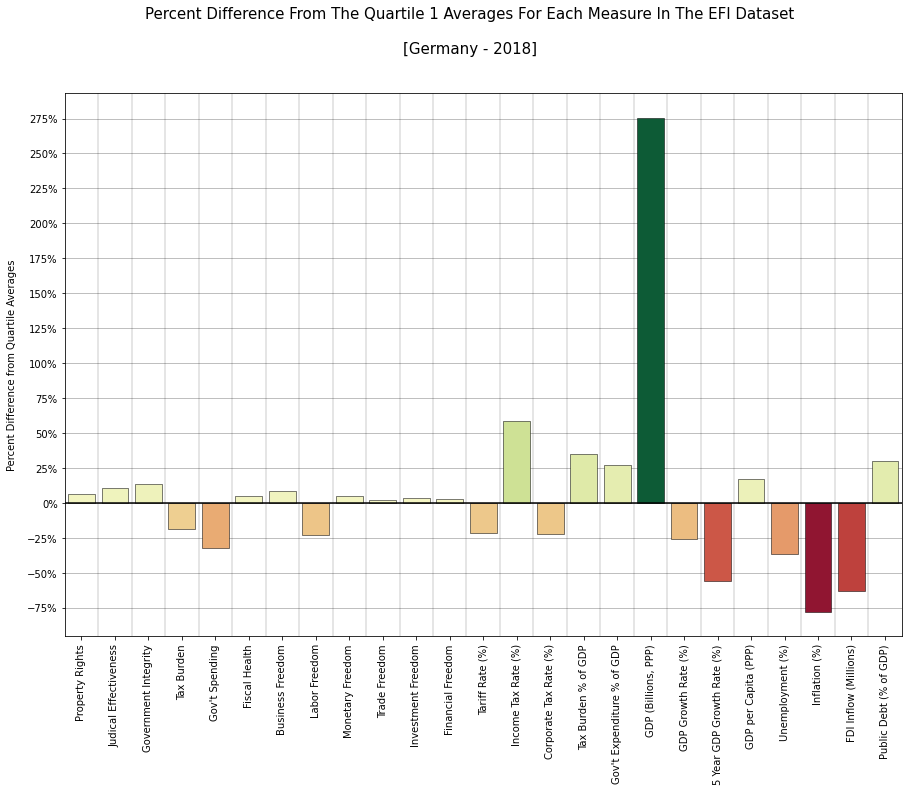
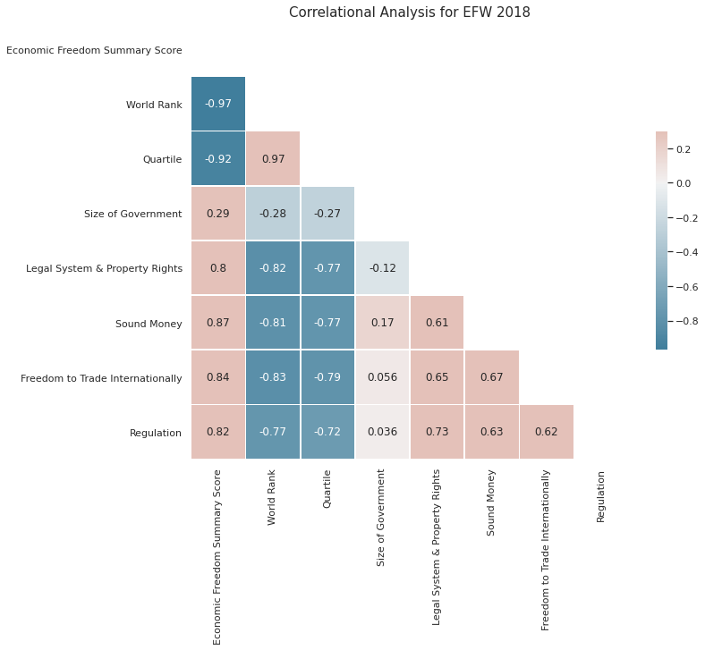
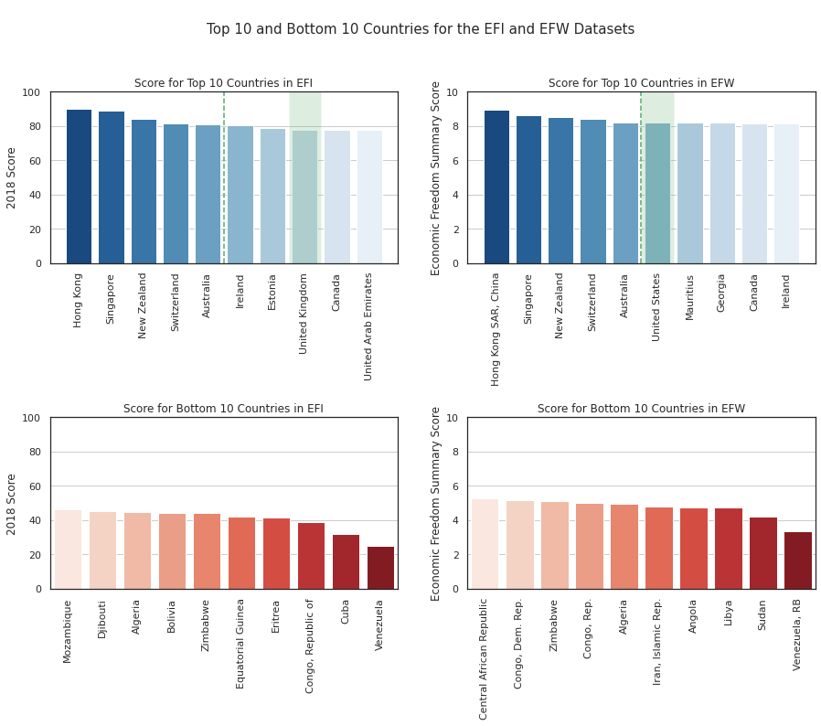
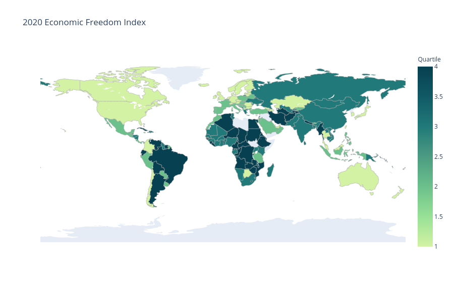
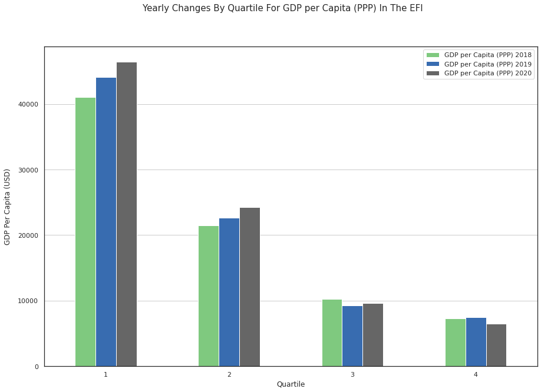

# Economic Freedom Analysis

## Overview 
Compared data from different years of the Economic Freedom Index (EFI) with each other as well as with data from the Economic Freedom of the World (EFW) dataset to see if there were any interesting trends or patterns we could identify.

[**Click here to view the notebook in nbviewer**](https://nbviewer.jupyter.org/github/dan-grant-hunter/Economic_Freedom_Analysis/blob/main/economic_freedom_analysis.ipynb)
 
## Summary of Findings
* Singapore now occupies the top spot as measured in the EFI 2020 dataset with Hong Kong slipping down to second place. This is an important observation as not only did Hong Kong score its highest in 2018 since the financial crash as well as rank first from 1995 in the EFI but also, as the authors of the EFW state:
>"*Hong Kong has been in the first position at the top of the EFW index for all years for which we have data*"

* Cuba and Venezuela score particularly low, even amongst the lowest 10 countries. While Venezuela still ranks last, Cuba's economic freedom score has lowered to a level that is almost equal to Venezuela.

* The variation in unemployment (%) for all years in the EFI datasets appears to be generally equal across all quartiles.

* GDP per capita increased much faster year on year for countries in the first or second quartile.

## Code and Resources Used 
**Python Version:** 3.8.5  
**Packages:** pandas, numpy, matplotlib, seaborn, plotly, chardet  
**EFI Datasets:** https://www.heritage.org/index/download  
**EFW Dataset:** https://www.fraserinstitute.org/studies/economic-freedom  

## Data Cleaning and Prep
After downloading the data for the EFI and EFW datasets, I needed to clean them up by ensuring that they contained only the relevant columns for the analysis and that values were consistent across each year and dataset. I also created various functions and variables which would aid us in exploring and comparing the data more efficiently in the EDA

#### EFI Datasets
For the EFI datasets, I made the following changes and created the following variables:

* Dropped all countries which had more than 10% of missing data 
* Imputed remaining missing values with figures from the EFI 2020 dataset 
* Removed redundant columns which did not convey any additional information
* Stripped whitespace from column names 
* Removed any text, currency symbols, commas or whitespace from numerical values 
* Converted numerical values with type object to numerical type 
* Mapped ISO code to each country 
* Assigned each country a quartile based on its world rank for that year

#### EFW Dataset
For the EFW dataset, I only needed to extract the most recent data (2018), filter out the important columns and convert quartile values from floats to integers (to ensure data consistency with the EFI values). For the important columns, I kept only the country information and ranking along with the summary scores for each of the five broad scoring areas.

## EFI Dataset Schema After Cleaning and Prep

| Column                     |
|----------------------------|
| Country Name               |
| Region                     |
| World Rank                 |
| Region Rank                |
| Year Score                 |
| Property Rights            |
| Judicial Effectiveness     |
| Government Integrity       |
| Tax Burden                 |
| Gov't Spending             |
| Fiscal Health              |
| Business Freedom           |
| Labor Freedom              |
| Monetary Freedom           |
| Trade Freedom              |
| Investment Freedom         |
| Financial Freedom          |
| Tariff Rate (%)            |
| Income Tax Rate (%)        |
| Corporate Tax Rate (%)     |
| Tax Burden % of GDP        |
| Gov't Expenditure % of GDP |
| Population (Millions)      |
| GDP (Billions, PPP)        |
| GDP Growth Rate (%)        |
| 5 Year GDP Growth Rate (%) |
| GDP per Capita (PPP)       |
| Unemployment (%)           |
| Inflation (%)              |
| FDI Inflow (Millions)      |
| Public Debt (% of GDP)     | 
| ISO Code						 |
| Quartile						 |

## EFW Dataset Schema After Cleaning and Prep

| Column                           |
|----------------------------------|
| ISO Code                         |
| Countries                        |
| Economic Freedom Summary Score   |
| World Rank                       |
| Quartile                         |
| Size of Government               |
| Legal System & Property Rights   |
| Sound Money                      |
| Freedom to Trade Internationally |
| Regulation							|

## EDA
I looked at how countries such as Germany and Mexico compare to world averages as well as how they compare to their respective quartile averages. I also compared the results of the different EFI datasets (2018, 2019, 2020) with each other as well as with the results from the EFW dataset.

Below are a few highlights from the analysis. 

## Notes

#### Data Accuracy
This analysis was performed in October 2020 using the most recent data available from the Heritage Foundation (EFI) and the Fraser Institute (EFW). While the Heritage Foundation released 2020 data for the EFI, most data only  covers the second half of 2018 through the first half of 2019 meaning that neither of the datasets accurately reflect countries' current economic freedom score. Due to this fact, and given the multitude of events which have transpired in 2020 such as Coronavirus and global protests, we may see drastically different scores in the data released next year (2021).
## Recommendations for Further Analysis
* Perform a more thorough analysis on the specific regions and the scores for each measure by region.
* Take a deeper look into the BRICS countries and how they are performing not only in relation to each other but also to other countries.
* Use machine learning algorithms and feature engineering to try and predict a country's score in the future given its scores for different measures over the years.
## References and Additional Information
#### EFI
* Terry Miller, Anthony B. Kim, James M. Roberts (2020). Economic Freedom Index Dataset, published in 2020 Index   of Economic Freedom. The Heritage Foundation. www.heritage.org/index/download  

*For more informationg regarding these datasets, visit - https://www.heritage.org/index/about*  
#### EFW
* James Gwartney, Robert Lawson, Joshua Hall, and Ryan Murphy (2020). Economic Freedom Dataset, published in Economic Freedom of the World: 2020 Annual Report. Fraser Institute. www.fraserinstitute.org/economic-freedom/dataset  

*For more information regarding this dataset, visit - https://www.fraserinstitute.org/studies/economic-freedom-of-the-world-2020-annual-report*
